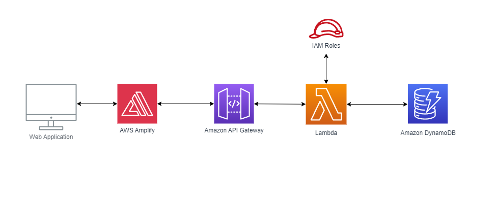

## Project Title
**CLOUDIFY**

## Project Description
This project showcases the integration of various AWS services in web development. It includes a frontend developed with HTML, CSS, and JavaScript, connected to a backend built using Node.js. The application utilizes Amazon DynamoDB for database operations and is hosted on AWS Amplify for continuous deployment and simplified management. AWS API Gateway integrates the frontend with AWS Lambda functions, enhancing scalability and reducing server management overhead. Security measures include AWS IAM roles.
## Architecture Diagram

## Features
- **Frontend:** Developed with HTML, CSS, and JavaScript.
- **Backend:** Built using Node.js.
- **Database:** Managed database operations with Amazon DynamoDB.
- **Hosting:** Deployed using AWS Amplify, ensuring continuous deployment and simplified management.
- **Serverless Computing:** Utilized AWS API Gateway to connect the frontend with AWS Lambda functions, reducing server management overhead.
- **Security:** Enhanced application security through AWS IAM roles.

## Installation and Setup
1. **Clone the Repository:**
   ```sh
   git clone https://github.com/saipreethamd20/cloudify.git
   cd cloudify 

## Setup AWS Amplify

1. **Go to AWS Amplify Console:**
   - Visit [AWS Amplify Console](https://console.aws.amazon.com/amplify/home).
   - Click on **Get Started**.

2. **Connect repository:**
   - Follow the instructions to connect Git repository (GitHub, GitLab, Bitbucket, etc.).

3. **Deploy the application:**
   - Deploy application using AWS Amplify.

## Configure AWS API Gateway and Lambda

1. **Create a new API in API Gateway:**
   - Go to [API Gateway Console](https://console.aws.amazon.com/apigateway/home).
   - Click **Create API**.
   - Choose the type of API (REST or WebSocket) and configure it.

2. **Set up methods and integrations with Lambda functions:**
   - Define the HTTP methods (GET, POST, etc.) for API resources.
   - Integrate these methods with AWS Lambda functions.

3. **Create Lambda functions:**
   - Go to [Lambda Console](https://console.aws.amazon.com/lambda/home).
   - Create new Lambda functions that API Gateway will invoke.
   - Write or upload function code.

4. **Link Lambda functions to API Gateway:**
   - In the API Gateway console, set up Lambda integrations for each method/resource.

## Set Up DynamoDB

1. **Create a new table in DynamoDB:**
   - Go to [DynamoDB Console](https://console.aws.amazon.com/dynamodb/home).
   - Click **Create table**.
   - Configure table settings (e.g., table name, primary key).

## Configure IAM Roles

 **Create IAM Roles:**
   - Define policy with necessary permissions for Amazon Lambda and DynamoDB.


## Usage

1. **Navigate to the deployed URL provided by AWS Amplify:**
   - Access application's frontend or API endpoint.

2. **Input base and exponent values:**
   - Use the integrated API to perform calculations or interact with DynamoDB.

## AWS Services Utilized

- **AWS Amplify:** Manages full application lifecycle, including continuous deployment, for front-end web and mobile applications.
- **API Gateway:** Provides fully managed service to create, publish, maintain, monitor, and secure APIs at any scale.
- **AWS Lambda:** Executes code in response to events, such as HTTP requests via API Gateway.
- **Amazon DynamoDB:** Fast and flexible NoSQL database service with consistent, single-digit millisecond latency at any scale.
- **AWS IAM:** Controls access to AWS services and resources securely.

## Resources

- [AWS Amplify Documentation](https://docs.aws.amazon.com/amplify)
- [API Gateway Documentation](https://docs.aws.amazon.com/apigateway)
- [AWS Lambda Documentation](https://docs.aws.amazon.com/lambda)
- [Amazon DynamoDB Documentation](https://docs.aws.amazon.com/amazondynamodb)
- [AWS IAM Documentation](https://docs.aws.amazon.com/IAM)


